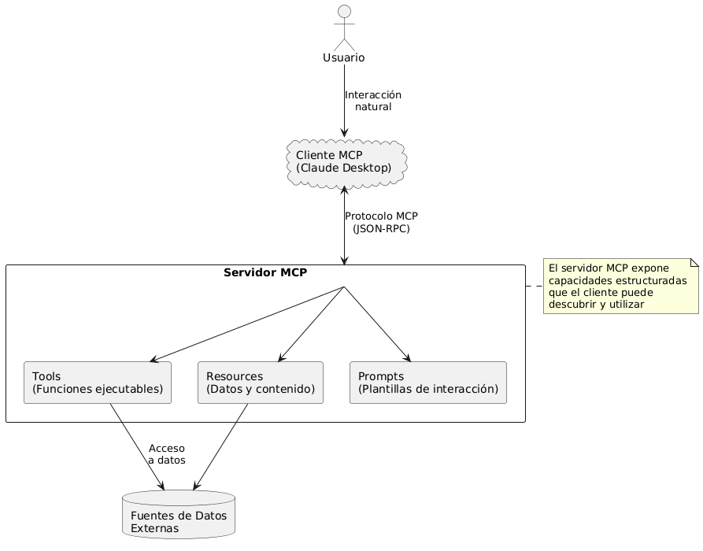
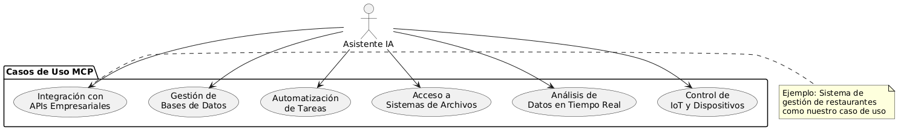
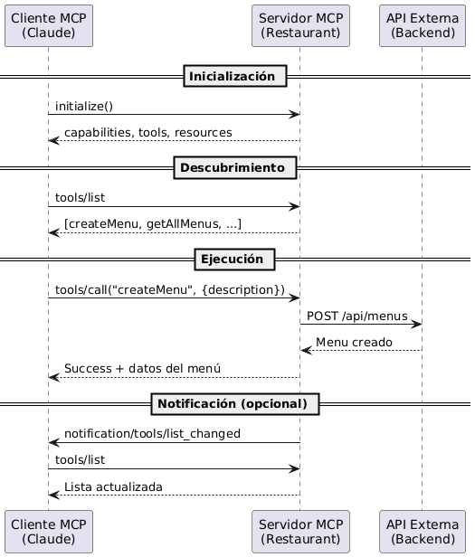
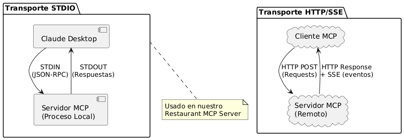
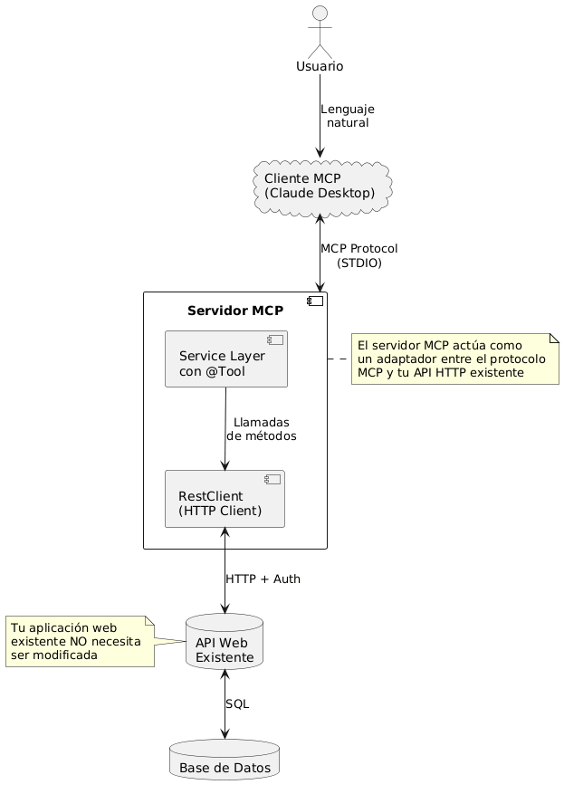
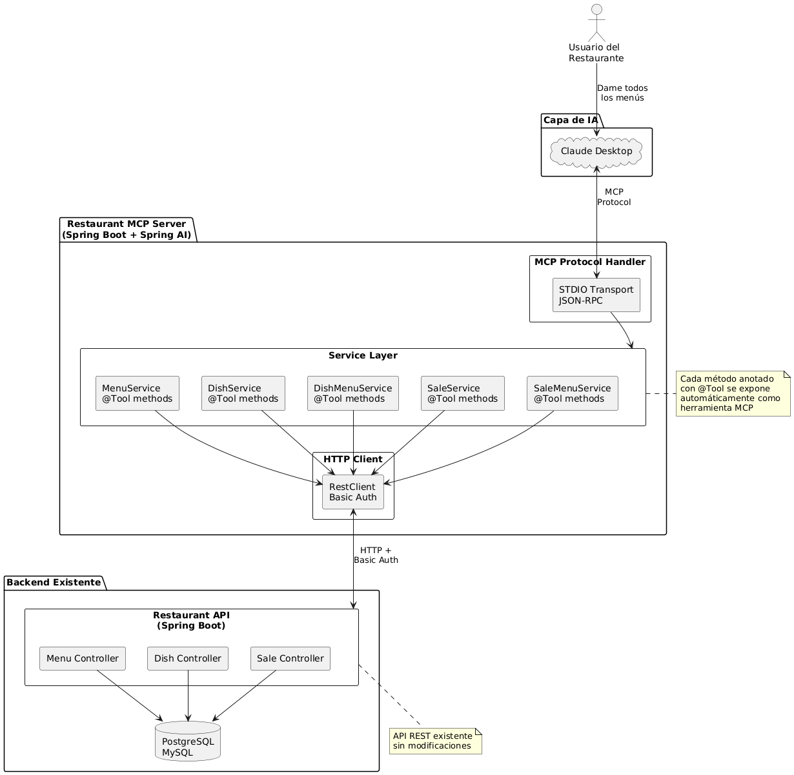
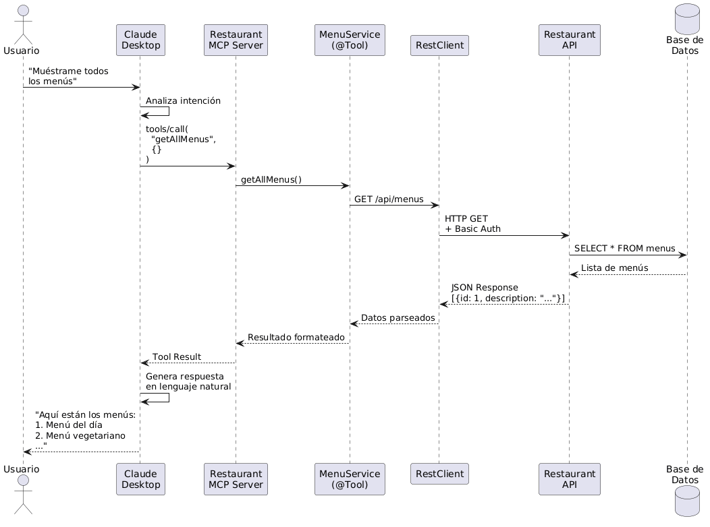

# Guía Introductoria: Model Context Protocol (MCP)

## Introducción

### ¿Qué es MCP?

**Model Context Protocol (MCP)** es un protocolo abierto estandarizado desarrollado por Anthropic que permite la integración bidireccional entre aplicaciones de IA y fuentes de datos externas o herramientas. MCP actúa como un "puente universal" que permite a los asistentes de IA interactuar con sistemas externos de manera estructurada y segura.

MCP define una arquitectura cliente-servidor donde:
- **Clientes MCP**: Aplicaciones de IA (como Claude Desktop) que necesitan acceder a datos o funcionalidades externas
- **Servidores MCP**: Servicios que exponen herramientas, recursos o prompts que los clientes pueden utilizar



### Características Principales

1. **Protocolo Estandarizado**: Define un contrato claro entre clientes y servidores usando JSON-RPC 2.0
2. **Descubrimiento Dinámico**: Los clientes pueden descubrir automáticamente qué herramientas y recursos están disponibles
3. **Seguridad**: Control granular sobre qué datos y operaciones están expuestos
4. **Extensibilidad**: Fácil de extender con nuevas capacidades sin modificar el cliente
5. **Transporte Flexible**: Soporta múltiples mecanismos de transporte (STDIO, HTTP/SSE, etc.)

## Uso

### ¿Para Qué Sirve MCP?

MCP resuelve el problema de conectar modelos de IA con el mundo real. Permite que los asistentes de IA:

1. **Accedan a Datos en Tiempo Real**
   - Consultar bases de datos
   - Leer archivos del sistema
   - Obtener información de APIs externas

2. **Ejecuten Acciones**
   - Crear, actualizar o eliminar registros
   - Ejecutar comandos del sistema
   - Interactuar con servicios externos

3. **Mantengan Contexto**
   - Acceder a recursos específicos del dominio
   - Utilizar plantillas de prompts predefinidas
   - Mantener estado entre interacciones

### Casos de Uso Comunes



**Ejemplos Prácticos:**
- **E-commerce**: Consultar inventario, crear órdenes, actualizar catálogo
- **CRM**: Gestionar clientes, crear tickets, generar reportes
- **DevOps**: Desplegar aplicaciones, consultar logs, monitorear servicios
- **Gestión de Restaurantes**: Administrar menús, platos, ventas (nuestro caso)

## Conceptos Básicos

### Arquitectura del Protocolo

MCP define tres tipos principales de primitivas que un servidor puede exponer:

#### 1. **Tools (Herramientas)**

Son funciones ejecutables que el cliente puede invocar. Cada `Tool` tiene:
- **Nombre**: Identificador único
- **Descripción**: Explicación de qué hace
- **Parámetros**: Schema JSON que define los inputs esperados
- **Implementación**: Lógica que se ejecuta cuando se invoca


#### 2. **Resources (Recursos)**

Son datos o contenido que el servidor expone. Pueden ser:
- Archivos
- Registros de base de datos
- Datos dinámicos
- Configuraciones

Cada recurso tiene un URI único y puede notificar cambios a los clientes suscritos.

#### 3. **Prompts (Plantillas)**

Son plantillas de interacción predefinidas que guían al usuario en tareas comunes. Facilitan la reutilización de flujos de conversación efectivos.

### Flujo de Comunicación



### Transporte: STDIO vs HTTP/SSE

MCP soporta diferentes mecanismos de transporte:

**STDIO (Standard Input/Output)**
- Comunicación mediante flujos estándar de entrada/salida
- Ideal para procesos locales lanzados por el cliente
- Usado en Claude Desktop
- Más ligero y directo

**HTTP con Server-Sent Events (SSE)**
- Comunicación sobre HTTP
- Permite servidores remotos
- Mejor para servicios en la nube
- Más escalable



## Integración MCP en Aplicaciones Web

### Patrón de Integración

La integración de MCP con aplicaciones web existentes sigue un patrón de **proxy inteligente**:



### Ventajas de Este Patrón

1. **No Invasivo**: Tu aplicación web existente no requiere cambios
2. **Reutilización**: Aprovechas tu API REST ya construida
3. **Seguridad**: El servidor MCP puede agregar capa adicional de autenticación/autorización
4. **Separación de Responsabilidades**: La lógica de negocio permanece en tu backend
5. **Flexibilidad**: Puedes exponer solo las operaciones que desees a través de MCP

## Caso de Uso: Restaurant Web App

### Contexto del Proyecto

Nuestro **Restaurant MCP Server** es un servidor MCP que expone operaciones de gestión de restaurantes como herramientas que pueden ser invocadas por Claude. El servidor actúa como un puente entre Claude Desktop y una API REST existente para gestión de restaurantes.

### Arquitectura de la Integración



### Componentes Clave

#### 1. **Service Layer con Anotaciones @Tool**

Cada operación de negocio se define como un método de servicio anotado con `@Tool`:

```java
@Tool(description = "Get all menus from the restaurant")
public String getAllMenus() {
    // Lógica para llamar a la API externa
}

@Tool(description = "Create a new menu with a description")
public String createMenu(String description) {
    // Lógica para crear menú
}
```

#### 2. **Spring AI MCP Server**

Utiliza la biblioteca `spring-ai-starter-mcp-server` que:
- Maneja el protocolo MCP automáticamente
- Descubre métodos con `@Tool`
- Gestiona el transporte STDIO
- Serializa/deserializa JSON-RPC

#### 3. **RestClient con Autenticación**

Cada servicio utiliza un `RestClient` configurado para comunicarse con la API backend:
- Autenticación Basic Auth
- Manejo de errores HTTP
- Serialización JSON automática

### Flujo de Interacción Completo



### Herramientas Expuestas

El servidor expone **25+ herramientas** organizadas en 5 categorías:

1. **Menu Operations** (5 tools)
   - `getAllMenus`, `getMenuById`, `createMenu`, `updateMenu`, `deleteMenu`

2. **Dish Operations** (5 tools)
   - `getAllDishes`, `getDishById`, `createDish`, `updateDish`, `deleteDish`

3. **Dish-Menu Relations** (6 tools)
   - `getAllDishMenus`, `getDishesByMenuId`, `getDishMenu`, `addDishToMenu`, `updateDishMenu`, `removeDishFromMenu`

4. **Sale Operations** (5 tools)
   - `getAllSales`, `getSaleById`, `createSale`, `updateSale`, `deleteSale`

5. **Sale-Menu Relations** (6 tools)
   - `getAllSaleMenus`, `getMenusBySaleId`, `getSaleMenu`, `addMenuToSale`, `updateSaleMenu`, `removeMenuFromSale`

### Configuración STDIO

El servidor está configurado para usar transporte STDIO:

```properties
# Transporte STDIO (no servidor web)
spring.ai.mcp.server.stdio=true
spring.main.web-application-type=none

# Logging deshabilitado (crítico para STDIO)
logging.level.root=OFF
```

Esto significa que:
- Claude Desktop lanza el JAR como un proceso hijo
- La comunicación ocurre mediante `stdin`/`stdout`
- No hay puerto HTTP expuesto
- El ciclo de vida es gestionado por Claude Desktop

## Referencias y Documentación

### Para Implementación Detallada

Este proyecto incluye documentación completa sobre la implementación:

1. **[README.md](./README.md)**: Documentación general del proyecto
   - Descripción general de arquitectura
   - Stack tecnológico utilizado
   - Modelo de entidades y herramientas disponibles
   - Configuración y ejecución
   - Ejemplos de uso con Claude

2. **[MCP_CONNECTION_GUIDE.md](./MCP_CONNECTION_GUIDE.md)**: Guía de conexión paso a paso
   - Configuración detallada de STDIO transport
   - Instrucciones de setup para Claude Desktop
   - Solución de problemas comunes
   - Formato de endpoints de la API
   - Variables de entorno y configuración de producción

### Recursos Externos

#### Documentación Oficial de MCP

- **[Model Context Protocol - Especificación](https://modelcontextprotocol.io/docs)**  
  Especificación completa del protocolo, incluyendo tipos de mensajes, flujos y mejores prácticas

- **[MCP - Build a Server (Java)](https://modelcontextprotocol.io/docs/develop/build-server#java)**  
  Guía específica para construir servidores MCP en Java

- **[Spring AI - MCP Server Documentation](https://docs.spring.io/spring-ai/reference/api/mcp/mcp-server-boot-starter-docs.html)**  
  Documentación oficial de Spring AI para el starter de MCP Server

- **[Spring AI Examples - MCP](https://github.com/spring-projects/spring-ai-examples/tree/main/model-context-protocol)**  
  Ejemplos de código de Spring AI para MCP

#### Recursos de Aprendizaje

- **[Anthropic - Introducing MCP](https://www.anthropic.com/news/model-context-protocol)**  
  Artículo de anuncio de MCP por Anthropic

- **[MCP GitHub Repository](https://github.com/modelcontextprotocol)**  
  Repositorio oficial con especificaciones, SDKs y ejemplos

### Diagramas de Arquitectura

Los diagramas PlantUML de este documento pueden ser renderizados usando:

- **[PlantUML Online Server](http://www.plantuml.com/plantuml/uml/)**  
  Renderizador online para visualizar los diagramas

### Stack Tecnológico del Proyecto

- **Spring Boot 3.5.6**: Framework de aplicación
- **Spring AI 1.0.3**: Biblioteca para integración MCP
- **Java 17**: Lenguaje de programación
- **Gradle 8.14.3**: Herramienta de construcción

## Próximos Pasos

### Para Comenzar

1. **Revisa el [README.md](./README.md)** para entender la arquitectura general
2. **Sigue el [MCP_CONNECTION_GUIDE.md](./MCP_CONNECTION_GUIDE.md)** para configurar tu entorno
3. **Construye el proyecto** con `./gradlew clean build`
4. **Configura Claude Desktop** con la ruta al JAR compilado
5. **Prueba las herramientas** interactuando con Claude en lenguaje natural