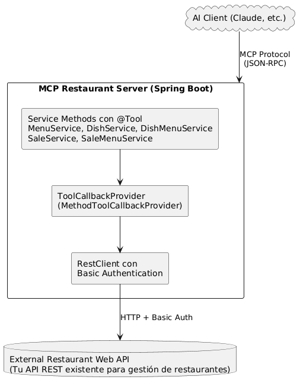

# Restaurant MCP Server

Un servidor Model Context Protocol (MCP) para gestión de restaurantes construido con Spring Boot y Spring AI.

## Descripción General

Este servidor MCP expone funcionalidades de gestión de restaurantes como herramientas que pueden ser llamadas por clientes de IA (como Claude). Proporciona operaciones CRUD completas para:

- **Menus** - Gestión de menús del restaurante
- **Dishes** - Gestión del catálogo de platos
- **Dish-Menu Relationships** - Asociar platos con menús (con precio y fecha)
- **Sales** - Registros de transacciones de ventas
- **Sale-Menu Relationships** - Rastrear qué menús fueron vendidos (con cantidad)

## Arquitectura



## Stack Tecnológico

- **Spring Boot 3.5.6** - Framework de aplicación
- **Spring AI 1.0.3** - Implementación del servidor MCP (`spring-ai-starter-mcp-server-webmvc`)
- **Java 17** - Lenguaje de programación
- **Gradle 8.14.3** - Herramienta de construcción
- **Jackson** - Serialización JSON

## Modelo de Entidades

Basado en el diagrama ER:

### MENUS (Menús)
- `menu_id` (PK) - Identificador del menú
- `Descripcion` - Descripción del menú

### PLATOS (Dishes)
- `plato_id` (PK) - Identificador del plato
- `tipo` - Tipo de plato
- `nombre` - Nombre del plato
- `descripcion` - Descripción del plato

### PLATOS_MENU (Dish-Menu)
- `menu_id` (PK, FK) - Referencia al menú
- `plato_id` (PK, FK) - Referencia al plato
- `precio` - Precio del plato en este menú
- `fecha` - Fecha en que se agregó al menú

### VENTAS (Sales)
- `venta_id` (PK) - Identificador de venta
- `fecha` - Fecha de venta

### VENTAS_MENU (Sale-Menu)
- `menu_id` (PK, FK) - Referencia al menú
- `venta_id` (PK, FK) - Referencia a la venta
- `cantidad` - Cantidad vendida

## Herramientas MCP Disponibles

### Herramientas de Menús (MenuService)
- `getAllMenus()` - Obtener todos los menús del restaurante
- `getMenuById(Long menuId)` - Obtener un menú específico por su ID
- `createMenu(String description)` - Crear un nuevo menú con una descripción
- `updateMenu(Long menuId, String description)` - Actualizar la descripción de un menú existente
- `deleteMenu(Long menuId)` - Eliminar un menú por su ID

### Herramientas de Platos (DishService)
- `getAllDishes()` - Obtener todos los platos del restaurante
- `getDishById(Long dishId)` - Obtener un plato específico por su ID
- `createDish(String type, String name, String description)` - Crear un nuevo plato
- `updateDish(Long dishId, String type, String name, String description)` - Actualizar un plato
- `deleteDish(Long dishId)` - Eliminar un plato por su ID

### Herramientas de Platos-Menús (DishMenuService)
- `getAllDishMenus()` - Obtener todas las relaciones plato-menú
- `getDishesByMenuId(Long menuId)` - Obtener todos los platos de un menú específico
- `getDishMenu(Long menuId, Long dishId)` - Obtener una relación plato-menú específica
- `addDishToMenu(Long menuId, Long dishId, Double price, String date)` - Agregar un plato a un menú
- `updateDishMenu(Long menuId, Long dishId, Double price, String date)` - Actualizar relación plato-menú
- `removeDishFromMenu(Long menuId, Long dishId)` - Remover un plato de un menú

### Herramientas de Ventas (SaleService)
- `getAllSales()` - Obtener todas las ventas del restaurante
- `getSaleById(Long saleId)` - Obtener una venta específica por su ID
- `createSale(String date)` - Crear un nuevo registro de venta
- `updateSale(Long saleId, String date)` - Actualizar la fecha de una venta
- `deleteSale(Long saleId)` - Eliminar una venta por su ID

### Herramientas de Ventas-Menús (SaleMenuService)
- `getAllSaleMenus()` - Obtener todas las relaciones venta-menú
- `getMenusBySaleId(Long saleId)` - Obtener todos los menús de una venta específica
- `getSaleMenu(Long menuId, Long saleId)` - Obtener una relación venta-menú específica
- `addMenuToSale(Long menuId, Long saleId, Integer quantity)` - Agregar un menú a una venta
- `updateSaleMenu(Long menuId, Long saleId, Integer quantity)` - Actualizar cantidad de menú en venta
- `removeMenuFromSale(Long menuId, Long saleId)` - Remover un menú de una venta

## Configuración

### application.properties

```properties
# Banner and Logging (disabled for STDIO)
spring.main.banner-mode=off
logging.level.root=OFF
logging.level.org.springframework=OFF  
logging.level.com.uptc.frw=OFF

# MCP Server - STDIO Transport
spring.ai.mcp.server.name=mcprestaurant
spring.ai.mcp.server.version=0.0.1
spring.ai.mcp.server.stdio=true
spring.main.web-application-type=none

# Change Notifications
spring.ai.mcp.server.resource-change-notification=true
spring.ai.mcp.server.tool-change-notification=true
spring.ai.mcp.server.prompt-change-notification=true

# External Restaurant API
restaurant.api.base-url=http://localhost:8080/api
restaurant.api.username=admin
restaurant.api.password=password
```

### Variables de Entorno

Configura mediante la sección `env` de Claude Desktop o variables de entorno del sistema:

**Opción 1: Configuración de Claude Desktop**
```json
{
  "mcpServers": {
    "restaurant": {
      "command": "/usr/bin/java",
      "args": ["-jar", "/path/to/mcprestaurant-0.0.1-SNAPSHOT.jar"],
      "env": {
        "RESTAURANT_API_BASE_URL": "http://localhost:8080/api",
        "RESTAURANT_API_USERNAME": "admin",
        "RESTAURANT_API_PASSWORD": "password"
      }
    }
  }
}
```

**Opción 2: Variables de Entorno del Sistema**
```bash
export RESTAURANT_API_BASE_URL=https://your-api.com/api
export RESTAURANT_API_USERNAME=your_username
export RESTAURANT_API_PASSWORD=your_password
```

## Construcción y Ejecución

### Construir el Proyecto

```bash
./gradlew clean build
```

### Ejecutar el Servidor

```bash
./gradlew bootRun
```

O ejecutar el JAR:

```bash
java -jar build/libs/mcprestaurant-0.0.1-SNAPSHOT.jar
```

## Requisitos de la API Externa

El servidor MCP espera que tu API externa de restaurante exponga los siguientes endpoints:

### Menus
- `GET /api/menus` - Listar todos los menús
- `GET /api/menus/{id}` - Obtener un menú por ID
- `POST /api/menus` - Crear un menú (body: `{"description": "..."`)
- `PUT /api/menus` - Actualizar un menú (body: `{"idMenu": ..., "description": "..."`)
- `DELETE /api/menus?id={id}` - Eliminar un menú (parámetro de consulta)

### Dishes
- `GET /api/dishes` - Listar todos los platos
- `GET /api/dishes/{id}` - Obtener un plato por ID
- `POST /api/dishes` - Crear un plato (body: `{"dishType": "...", "name": "...", "description": "..."`)
- `PUT /api/dishes` - Actualizar un plato (body: `{"id": ..., "dishType": "...", "name": "...", "description": "..."`)
- `DELETE /api/dishes?id={id}` - Eliminar un plato (parámetro de consulta)

### Dish-Menus
- `GET /api/dish-menus` - Listar todas las relaciones
- `GET /api/dish-menus/{menuId}/{dishId}` - Obtener relación específica
- `POST /api/dish-menus` - Crear relación (body: `{"idMenu": ..., "idDish": ..., "price": ..., "date": "..."`)
- `PUT /api/dish-menus` - Actualizar relación (body: `{"idMenu": ..., "idDish": ..., "price": ..., "date": "..."`)
- `DELETE /api/dish-menus?idmenu={id}&iddish={id}` - Eliminar relación (parámetros de consulta)

### Sales
- `GET /api/sales` - Listar todas las ventas
- `GET /api/sales/{id}` - Obtener una venta por ID
- `POST /api/sales` - Crear una venta (body: `{"date": "..."`)
- `PUT /api/sales` - Actualizar una venta (body: `{"id": ..., "date": "..."`)
- `DELETE /api/sales?id={id}` - Eliminar una venta (parámetro de consulta)

### Sale-Menus
- `GET /api/SalesMenu` - Listar todas las relaciones
- `GET /api/SalesMenu/sale/{saleId}` - Obtener menús de una venta
- `GET /api/SalesMenu/{menuId}/{saleId}` - Obtener relación específica
- `POST /api/SalesMenu` - Crear relación (body: `{"menuId": ..., "saleId": ..., "quantity": ...}`)
- `PUT /api/SalesMenu` - Actualizar relación (body: `{"idMenu": ..., "idSale": ..., "quantity": ...}`)
- `DELETE /api/SalesMenu?idmenu={id}&idsale={id}` - Eliminar relación (parámetros de consulta)

### Patrones Clave

**Crear (POST):** Todos los datos en el body JSON  
**Actualizar (PUT):** Todos los datos incluyendo IDs en el body JSON (sin parámetros de ruta)  
**Eliminar (DELETE):** IDs como parámetros de consulta (ej., `?id={id}` o `?idmenu={id}&iddish={id}`)  
**Obtener por ID (GET):** ID en la ruta (ej., `/menus/{id}`)  
**Obtener relaciones (GET):** Parámetros de ruta o consulta según sea necesario

## Conexión a Claude Desktop

Este servidor utiliza **transporte STDIO** - Claude Desktop lanza el JAR directamente y se comunica mediante flujos de entrada/salida estándar.

### Configuración Rápida

1. **Construir el servidor:**
   ```bash
   ./gradlew clean build
   ```

2. **Configurar Claude Desktop** - Edita `~/Library/Application Support/Claude/claude_desktop_config.json`:
   ```json
   {
     "mcpServers": {
       "restaurant": {
         "command": "/usr/bin/java",
         "args": [
           "-jar",
           "/Users/javiersandoval/Documents/Projects/MCPRestaurant/build/libs/mcprestaurant-0.0.1-SNAPSHOT.jar"
         ],
         "env": {
           "RESTAURANT_API_BASE_URL": "http://localhost:8080/api",
           "RESTAURANT_API_USERNAME": "admin",
           "RESTAURANT_API_PASSWORD": "password"
         }
       }
     }
   }
   ```

3. **Reiniciar Claude Desktop** - El servidor se lanzará automáticamente cuando sea necesario.

### Notas de Arquitectura

- **Transporte:** STDIO (flujos de entrada/salida estándar)
- **Tipo de Aplicación:** No-web (`spring.main.web-application-type=none`)
- **Logging:** Completamente deshabilitado para prevenir corrupción del protocolo JSON-RPC
- **Ciclo de Vida:** Gestionado por Claude Desktop (inicio/parada automática)

Para configuración detallada, solución de problemas y formatos de endpoints de API, ver [MCP_CONNECTION_GUIDE.md](./MCP_CONNECTION_GUIDE.md).

## Estructura del Proyecto

```
src/main/java/com/uptc/frw/mcprestaurant/
├── model/
│   ├── Menu.java              # Entidad Menu
│   ├── Dish.java              # Entidad Dish
│   ├── DishMenu.java          # Relación Dish-Menu
│   ├── Sale.java              # Entidad Sale
│   └── SaleMenu.java          # Relación Sale-Menu
├── service/
│   ├── MenuService.java       # Herramientas de Menu (métodos @Tool)
│   ├── DishService.java       # Herramientas de Dish (métodos @Tool)
│   ├── DishMenuService.java   # Herramientas de Dish-Menu (métodos @Tool)
│   ├── SaleService.java       # Herramientas de Sale (métodos @Tool)
│   └── SaleMenuService.java   # Herramientas de Sale-Menu (métodos @Tool)
└── McprestaurantApplication.java  # Aplicación principal con ToolCallbackProviders
```

## Cómo Funciona

1. **Anotación @Tool**: Cada método de servicio está anotado con `@Tool` y una descripción
2. **ToolCallbackProvider**: La aplicación principal registra cada servicio como un `MethodToolCallbackProvider`
3. **Protocolo MCP**: Spring AI MCP Server automáticamente expone estas herramientas mediante el protocolo MCP
4. **Integración con IA**: Los clientes de IA (como Claude) pueden descubrir e invocar estas herramientas
5. **API Externa**: Cada método de herramienta llama a la API externa del restaurante usando RestClient con Basic Auth

## Ejemplo de Uso

Una vez conectado a Claude, puedes preguntar:

- "Muéstrame todos los menús del restaurante"
- "Crea un nuevo plato llamado 'Pasta Carbonara' de tipo 'Main Course'"
- "Agrega el plato con ID 5 al menú con ID 2 con un precio de 15.99"
- "¿Qué platos hay en el menú 1?"
- "Crea una nueva venta para hoy"
- "Agrega el menú 2 con cantidad 3 a la venta 10"

Claude automáticamente llamará las herramientas MCP apropiadas para cumplir estas solicitudes.

## Referencias

- [Documentación de Model Context Protocol](https://modelcontextprotocol.io/docs/develop/build-server#java)
- [Documentación de Spring AI MCP Server](https://docs.spring.io/spring-ai/reference/api/mcp/mcp-server-boot-starter-docs.html)
- [Ejemplos de Spring AI en GitHub](https://github.com/spring-projects/spring-ai-examples/tree/main/model-context-protocol)

## Licencia

Este proyecto es para fines educativos.
